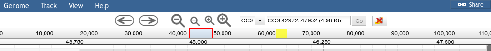

# ThemeComponent-RearrangedRulers

A JBrowse 'Theme Component' which rearranges the rulers to be next to each other, and removes the "zoomed region" blue bar.



# Usage

Add the following to your `trackList.json`. If you have an existing plugins section, you should add the plugin to that section.

```json
"plugins": [
	{
		"name": "ThemeComponent-RearrangedRulers",
		"location" : "https://cdn.rawgit.com/jbrowse-themes/ThemeComponent-RearrangedRulers/18744363d3f7cbad6d787a7ceb05169a3704c3d9"
	}
]
```

# LICENSE

GPL-3.0
